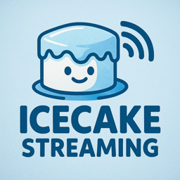

<p align="center">
  
</p>

# Icecake.Ingest.Streaming
**Unofficial C# client for Snowflake Snowpipe Streaming (V2)**

`Icecake.Ingest.Streaming` is a lightweight, high-performance C# library for sending data to **Snowflake Snowpipe Streaming V2**.

This project is **not affiliated with Snowflake Inc.**, is **not an official SDK**, and is **not endorsed or supported by Snowflake**.  
It uses *only* Snowflake’s **publicly documented APIs** and intentionally mirrors the conceptual structure of Snowflake’s Java/Python Streaming SDKs (`Client` + `Channel`), while offering an idiomatic C# implementation.

The main abstractions are:

- `SnowpipeIngestClient`
- `SnowpipeIngestChannel`

These map closely to Snowflake’s own ingestion clients in their official language SDKs.

> ⚠️ **Disclaimer**  
> This library is community-maintained.  
> API compatibility with Snowflake may require updates as Snowflake evolves their services.

---

## ✨ Features

- ✔ Fully supports **Snowpipe Streaming V2 ingestion**
- ✔ Async batching and ingestion
- ✔ Automatic:
  - Chunk creation
  - GZIP compression
  - MD5 checksumming
- ✔ RSA key-pair authentication (PKCS#1 / PKCS#8 — encrypted or unencrypted)
- ✔ Offset token support for resumable ingestion
- ✔ Multi-target builds:
  - `.NET 8.0` — full capability
  - `netstandard2.0` — maximum compatibility with polyfills
- ✔ Dependency-light, efficient, production-friendly

---

## 📦 Packages

### **Icecake.Ingest.Streaming**

Core ingestion client:

```
dotnet add package Icecake.Ingest.Streaming
```

### **Icecake.Ingest.Streaming.Services**

Optional helpers for DI, configuration, and hosted execution:

```
dotnet add package Icecake.Ingest.Streaming.Services
```

---

## 🚀 Example Usage with Dependency Injection

### ⚙️ Example `appsettings.jsonc`


```jsonc
{
  "Snowflake": {
    "Account": {
      "OrganizationName": "A1234567890123",
      "AccountName": "HELLO_ACCOUNT"
    },
    "Credentials": {
      "User": "ingestion",
      "PrivateKeyPath": "ingestion_key.p8"
    },
    "Connect": {
      "Database": "HELLO_DB",
      "Schema": "PUBLIC",
      "Role": "HELLO_ROLE",
      "Warehouse": "HELLO_WH"
    },

    // Default client options (change as needed)
    "ClientOptions": {

      // User-Agent header included in every request
      "UserAgent": "snowflake-ingest-dotnet/0.1",

      // Timeout for HTTP operations
      "Timeout": "00:01:00",

      // Base delay for retry backoff
      "RetryBackoffBase": "00:00:00.200",

      // Maximum retry attempts
      "MaxRetries": 5,

      // HTTP proxy configuration (set null if unused)
      "Proxy": null,

      // Validate SSL/TLS certificates
      "ValidateCertificates": true,

      // Enable GZIP compression for ingestion payloads
      "EnableGzipOnAppend": true,

      // Minimum number of bytes before GZIP is applied
      "GzipMinBytes": 4096,

      // GZIP compression level (Fastest | Optimal | etc.)
      "GzipLevel": "Fastest"
    }
  }
}
```

---

## 🏗️ Build Phase (registering the client)

```csharp
builder.Services.ConfigureRegisterSnowpipeIngestClient(builder.Configuration);

// OR — if using a custom config layout:
builder.Services.AddSnowpipeIngestClient();
```

---

## 🔥 Runtime Example (end-to-end flow)

```csharp
using var host = builder.Build();
await host.StartAsync();

using var scope = host.Services.CreateScope();

var client  = scope.ServiceProvider.GetRequiredService<SnowpipeIngestClient>();
var helper  = scope.ServiceProvider.GetRequiredService<SnowflakeHelper>();
var logger  = scope.ServiceProvider.GetRequiredService<ILogger<Program>>();
var chLogger = scope.ServiceProvider.GetRequiredService<ILogger<SnowpipeIngestChannel>>();

var table = new SchemaObjectCoords
{
    Database = "HELLO_DB",
    Schema   = "PUBLIC",
    Name     = "TELEMETRIES",
};

var schema = new TableSchema
{
    SchemaObject = table,
    ColumnsByName = new()
    {
        ["ID"]    = new() { Name = "ID",    Type = SnowflakeType.NUMBER },
        ["VALUE"] = new() { Name = "VALUE", Type = SnowflakeType.VARCHAR }
    }
};

// Channel name should remain stable for the same app instance
var channelName = $"IngestionApp_{Environment.MachineName}_{table.Name}_ch";
var pipeName    = $"{table.Name}_PIPE";

// Ensure Snowflake-side pipe exists, that's optional!
await helper.EnsureStreamingPipeForTableAsync(table, pipeName);

// Create ingestion channel
var channel = new SnowpipeIngestChannel(
    channelName,
    pipeName,
    schema,
    client,
    new FlushPolicy(),
    chLogger
);

await channel.OpenAsync();

// Build rows
var rows = new List<Dictionary<string, object?>>();
int id = 1000;

for (int i = 0; i < 10; i++)
{
    rows.Add(new()
    {
        ["ID"]    = id++,
        ["VALUE"] = Guid.NewGuid().ToString()[..10]
    });
}

// Adding an offset token to the next flush.
// The offset token is not strictly required, but it is highly useful:
//   - It tracks how Snowflake processes the data your application ingests
//   - It enables recovery / resume logic for ingestion workflows
//
// Note:
// Icecake behaves differently from Snowflake’s official SDKs here.
// In the Java/Python clients, offset tokens are passed with the Rows ingested.
// In Icecake, the offset token is *explicitly* attached to the next flush,
// that's what happens in practice.
channel.SetOffsetTokenForNextFlush($"{id}");

// Queue rows for ingestion
channel.InsertRows(rows);

// Flush to Snowflake
await channel.FlushAsync(offsetToken: $"{id}");

// Wait for Snowflake to confirm
var committed = await channel.FetchLatestCommittedOffsetAsync(
    timeOutSeconds: 20,
    pollMilliseconds: 250
);
// 20 seconds should be enough!
logger.LogInformation("Committed offset: {Offset}", committed ?? "<pending>");

// Clean shutdown
await channel.DisposeAsync();

// The channel can be reopened at any time.
await channel.OpenAsync();

// Retrieve the latest committed offset again.
// This should match the previously confirmed offset.
var committedOffsetBackAgain = await channel.FetchLatestCommittedOffsetAsync();

// Add more rows
var moreRows = new List<Dictionary<string, object?>>();

for (var i = 0; i < 10; i++)
{
    moreRows.Add(new Dictionary<string, object?>
    {
        ["ID"] = id++,
        ["VALUE"] = Guid.NewGuid().ToString()[..10]
    });
}

// Attach an offset token to the next flush.
// As before, Icecake requires explicitly assigning the offset token
// to the next flush, rather than relying on implicit behavior.
channel.SetOffsetTokenForNextFlush($"{id}");

// Queue and flush the rows
channel.InsertRows(moreRows);
await channel.FlushAsync();

// Dispose the channel locally
await channel.DisposeAsync();

// The channel continues to exist on the Snowflake side unless explicitly dropped.
// For long-running ingestion apps, channels should typically be kept and reused,
// since they allow resuming ingestion and offset tracking across restarts.
//
// Here we drop it just for demonstration.
await channel.DropAsync();
```

---

## 🔐 Authentication

This library supports:

- RSA key-pair authentication
- PKCS#1 and PKCS#8 (encrypted or plaintext)
- Automatic computation of Snowflake’s fingerprint format:  
  **`SHA256:<Base64Digest>`**
- Uses **BouncyCastle** for compatibility on `netstandard2.0`

---

## ⚠️ Not an official Snowflake SDK

To restate:

- This package is **not created, supported, or endorsed by Snowflake**
- Only **public REST APIs** are used
- Behavior is inspired by Snowflake’s Java/Python SDKs but adapted for C#
- Snowflake updates may require library changes

---

## 🤝 Contributing

Issues and PRs are welcome.  
If Snowflake updates their streaming API, please open an issue so we can track compatibility.

---

## 📄 License

MIT License.
